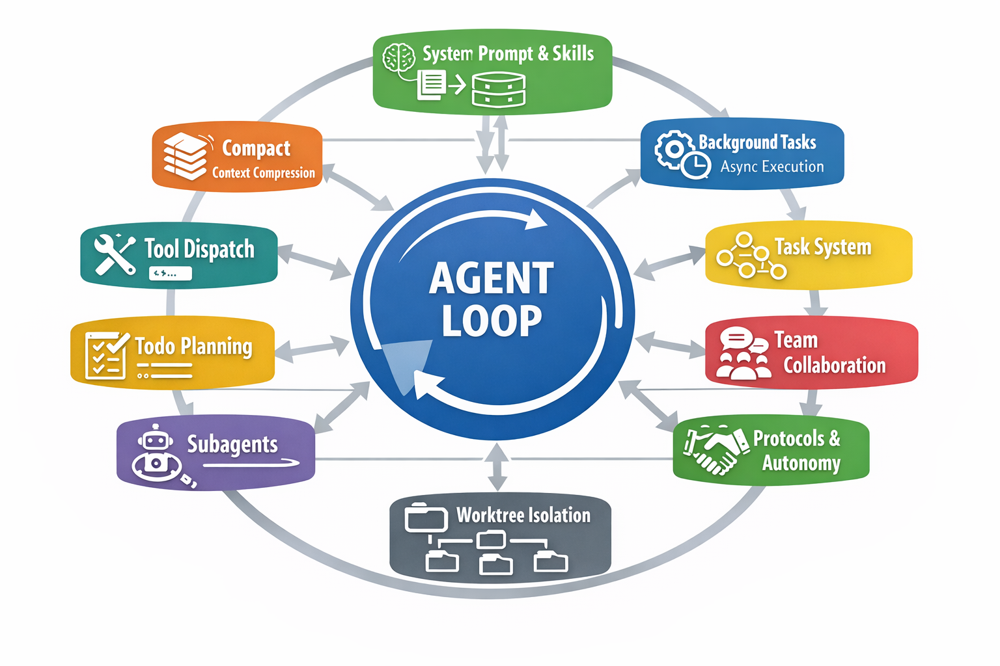
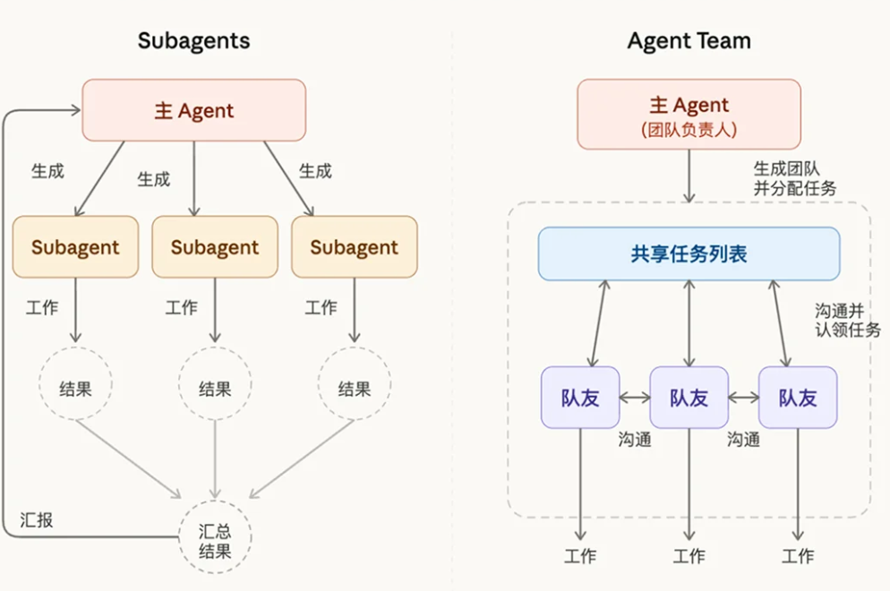
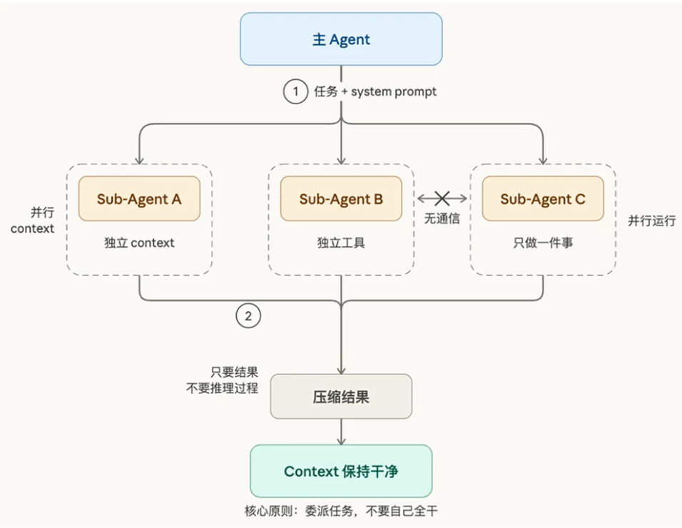
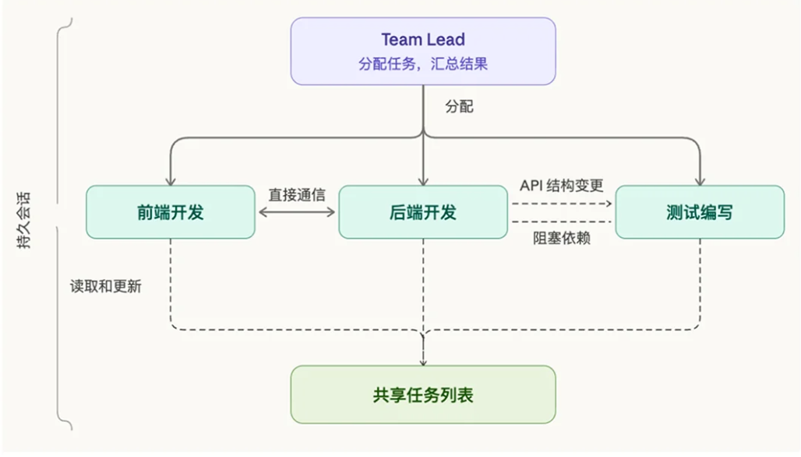

# 🧠 Agent Harness 从 0 到 1 指北

主包给 [learn-claude-code ](https://github.com/shareAI-lab/learn-claude-code)项目代码加了一点注释，以及这是主包的笔记喵～
> **一句话总结：** Agent = Model + Harness\
> 👉 真正决定 Agent 能力上限的，不是模型，而是 Harness。

------------------------------------------------------------------------

## 📌 目录

- [1. 什么是 Harness？](#1-什么是-harness)
- [2. 了解 Anthropic API](#2-了解-anthropic-api)
- [3. 核心能力分层（S01–S12）](#3-核心能力分层s01--s12)

    （1）基础构建 (S01 - S03)
    - [S01: Agent Loop (基本循环)](#s01-the-agent-loop基本循环)
    - [S02: Tool Use (工具调用)](#s02-tool-use工具调用)
    - [S03: Todo Planning (规划)](#s03-todowrite列计划)

    （2）上下文与知识管理 (S04 - S06)
    - [S04: Subagents (子智能体)](#s04-subagents子智能体)
    - [S05: Skill System (技能)](#s05-skill技能系统)
    - [S06: Context Compact (上下文压缩)](#s06-context-compact上下文压缩)

    （3）多智能体协作系统 (S07 - S10)
    - [S07: Task System (任务系统)](#s07-task-system任务系统)
    - [S08: Background Tasks (后台任务)](#s08-background-tasks后台任务)
    - [S09: Agent Teams (智能体团队)](#s09-agent-teams团队)
    - [S10: Team Protocols (团队协议)](#s10-team-protocols协议)
    - [S11: Autonomous Agents (自治智能体)](#s11-autonomous-agents自治)
    - [S12: Worktree Isolation (worktree任务隔离)](#s12-worktree--task-isolation隔离)
- [总结](#-总结)
- [Reference](#reference)
------------------------------------------------------------------------

# 1. 什么是 Harness？

## 🧩 定义

> **Agent = Model + Harness**

-   Model：模型权重（推理能力）
-   Harness：模型之外的一切（执行环境）

👉  类比计算机系统，看本仓库教程确实有种学OS的感觉（笑）。
| 组件 | 对应 |
|:----:|:----:|
| Model | CPU |
| Context | 内存 |
| Harness | 操作系统 |
| Agent | 应用程序 |

什么是 Harness Engineering: Agent 犯了错 → 不是改 prompt 重试 → 而是改环境让它不可能再犯这个错。
> "Harness engineering is the idea that anytime you find an agent makes a mistake, you take the time to engineer a solution such that the agent never makes that mistake again.<sup>[1]</sup>"

------------------------------------------------------------------------

## 🔥 为什么 Harness 更重要？

决定 Agent 落地效果的关键，已不只是模型能力本身，而在于系统能否提供清晰边界、自动校验和可复用的纠错流程。

根据 LangChain 的实验分析<sup>[2]</sup>，Harness 是提升 Agent 性能的关键，原因如下：

* **性能跨越**：在模型固定（GPT-5.2-Codex）的前提下，仅靠优化 Harness 就让 Agent 排名从前 30 跃升至前 5。

* **纠正认知缺陷**：通过 **Loop Detection**（死循环检测）和 **Self-Verification**（强制自检）克服模型易产生的逻辑死循环和过度自信。

* **消除环境盲区**：通过 **Context Engineering** 在启动时注入目录树和工具路径，为模型提供精确“地图”，避免盲目搜索。

* **资源极限利用**：利用 **Reasoning Sandwich**（规划与验证用高推理，中间过程用标准模式）在有限 Token 与时间内压榨出最高成功率。

* **定义执行上限**：模型只是 CPU，Harness 则是操作系统（OS）；它决定了 Agent 在现实物理世界中完成闭环任务的落地能力。
------------------------------------------------------------------------

## 📌 工程启示
我们正朝着训练环境与推理环境的融合迈进。作为开发者和开发者，重点应当转向<sup>[3]</sup>：

1. **Start Simple**：少写控制逻辑，让模型自己规划

2. **Build to Delete**：模块化设计，方便被新模型替换

3. **Harness is Dataset**：运行轨迹 = 下一代训练数据

------------------------------------------------------------------------

## 🧠 Prompt -> Context -> Harness
这三个概念的关系经常被误解为"一代比一代强，后面的替代前面的"。但实际上它们是包含关系<sup>[4]</sup>：

    Harness ⊃ Context ⊃ Prompt

| Engineering 类型        | 管理对象              | 核心问题                                             | 失败后的处理策略                         |
|------------------------|-----------------------|------------------------------------------------------|------------------------------------------|
| Prompt Engineering     | 单条指令    | 如何设计提问，使模型一次性输出高质量结果             | 调整 Prompt 并重新生成                   |
| Context Engineering    | 上下文窗口 | 如何组织与提供足够信息，以支持复杂任务的推理与执行   | 优化检索、压缩或上下文隔离策略           |
| Harness Engineering    | 系统环境   | 如何构建稳定系统，使 Agent 能长期、可靠地执行任务    | 改造系统环境，从根源上避免同类错误再次发生 |

------------------------------------------------------------------------

## 🧱 本仓库 Harness 组成

| 模块 (Module) | 核心逻辑 (Harness Logic)                          | 解决的痛点                                     |
|---------------|---------------------------------------------------|----------------------------------------------|
| 循环 (Loop)   | While True 持续检查 stop_reason。                  | 避免用户手动粘贴结果，实现初步自动化。             |
| 分发 (Dispatch)| TOOL_HANDLERS 映射表。                             | 解耦工具代码与循环体，支持路径沙箱安全。           |
| 规划 (Todo)   | TodoManager 状态维护 + Nag 注入。                  | 防止长对话中模型丢失进度、即兴发挥。               |
| 隔离 (Subagent)| 派生独立 messages[] 的临时工。                     | 守护主对话思维清晰度，防止上下文污染。             |
| 知识 (Skill)  | SKILL.md 的双层加载机制。                          | 降低 System Prompt 成本，实现领域专长按需加载。    |
| 压缩 (Compact)| 占位符、自动摘要、手动触发三级策略。                | 应对 Context Rot，换取在大项目中的“无限会话”。     |
| 任务 (Task)   | 磁盘持久化的 JSON DAG 任务图。                     | 明确任务依赖，为多 Agent 并行打下骨架。            |
| 后台 (Background)| 守护线程运行 + 锁机制通知队列。                   | 解决慢操作（如测试、编译）导致的模型干等问题。     |
| 团队 (Team)   | 持久化智能体身份 + JSONL 邮箱总线。                | 实现跨多轮对话、有身份识别的长期协作。             |
| 协议 (Protocol)| request_id 驱动的审批与关机握手。                  | 从“无监督乱跑”升级为“有审批、可管控”的组织。      |
| 自治 (Autonomy)| 状态轮询（WORK/IDLE）+ 任务认领机制。              | 无需 Lead 手动指派，Agent 自主找活并同步身份。     |
| 目录 (Worktree)| 任务=控制平面，Worktree=执行平面。                 | 彻底解决多 Agent 并行修改同一文件的环境污染。     |


------------------------------------------------------------------------

# 2. 了解 Anthropic API

本仓库基于 Anthropic 库构建 Agent，所以有必要先了解一下对话 API：

- Anthropic  API 采用的是多模态消息格式，所有的输入和输出都包裹在 `content` 数组的 `block` 中。
- 在 Anthropic 的 Messages API 中，`content` 不再仅仅是字符串，而是一个对象数组。每个对象就是一个 `block`。Agent 交互中主要涉及三种类型的 Block：
    1. `text` block: 普通文本对话。
    2. `tool_use` block: 模型发出的调用指令（模型输出）。
    3. `tool_result` block: 外部工具返回的结果（用户输入）。
  - Block 具体结构拆解
    1. 模型请求调用工具 (`tool_use` block, role: assistant)
      当 Agent 决定使用工具时，模型会生成一个 type: "tool_use" 的块。

    ```JSON
    {
        "type": "tool_use",
        "id": "toolu_01A02Z3AB45", // 唯一的调用 ID，后续必须对应
        "name": "legal_search",     // 你在 tools 中定义的函数名
        "input": {                  // 必须符合你定义的 JSON Schema
            "query": "Mietzins Verzug",
            "language": "de"
        }
    }
    ```
    2. 开发者返回结果 (`tool_result` block, role: user)
      你运行完本地代码后，必须将结果以 tool_result 的形式“喂”回给模型。
      注意`tool_result` block中只包含 `tool_use_id`（对应模型调用工具时的 ID），但没有工具名。要通过`assistant` 消息中的 `tool_use` 块，才能建立「ID→工具名」的映射
    
    ```JSON
    {
        "type": "tool_result",
        "tool_use_id": "toolu_01A02Z3AB45", // 必须与上面的 ID 完全一致
        "content": "Found Art. 257c OR...",    // 工具输出的内容
        "is_error": false                   // 如果执行报错，设为 true
    }
    ```
------------------------------------------------------------------------

# 3. 核心能力分层（S01--S12）

## S01: The Agent Loop（基本循环）

> "One loop & Bash is all you need" -- 一个工具 + 一个循环 = 一个智能体。

> Harness 层: 循环 -- 模型与真实世界的第一道连接。

- 问题：古法使用LLM：语言模型能推理代码, 但碰不到真实世界 -- 不能读文件、跑测试、看报错。没有循环, 每次工具调用你都得手动把结果粘回去。你自己就是那个循环。

- 解决：一个退出条件控制整个流程。循环持续运行, 直到模型不再调用工具。
    1. 用户 prompt 作为第一条消息
    2. 将消息（包括SYSTEM提示）和工具定义一起发给 LLM
    3. 追加助手响应。检查 `stop_reason` -- 如果模型没有调用工具, 结束
    4. 执行每个工具调用, 收集结果, 作为 user 消息追加。回到第 2 步。

    ```python
    # -- The core pattern: a while loop that calls tools until the model stops --
    def agent_loop(messages: list):
        while True:
            response = client.messages.create(
                model=MODEL, system=SYSTEM, messages=messages,
                tools=TOOLS, max_tokens=8000,
            )
            # Append assistant turn
            messages.append({"role": "assistant", "content": response.content})
            # If the model didn't call a tool, we're done
            if response.stop_reason != "tool_use":
                return
            # Execute each tool call, collect results
            results = []
            for block in response.content:
                if block.type == "tool_use":
                    print(f"\033[33m$ {block.input['command']}\033[0m")
                    output = run_bash(block.input["command"])
                    print(output[:200])
                    results.append({"type": "tool_result", "tool_use_id": block.id,
                                    "content": output}) # 本地代码运行的结果要用tool_result喂回去
            messages.append({"role": "user", "content": results})
    ```
------------------------------------------------------------------------

## S02: Tool Use（工具调用）

> "加一个工具, 只加一个 handler" -- 循环不用动, 新工具注册进 dispatch map 就行。

> Harness 层: 工具分发 -- 扩展模型能触达的边界。
- 问题：只有 bash 时, 所有操作都走 shell。cat 截断不可预测, sed 遇到特殊字符就崩, 每次 bash 调用都是不受约束的安全面。专用工具 (`read_file`, `write_file`) 可以在工具层面做路径沙箱。

- 解决：加工具不需要改循环。
    1. 每个工具有一个处理函数。路径沙箱防止逃逸工作区。
    2. dispatch map（就是`TOOL_HANDLERS`）将工具名映射到处理函数。
    ```python
    # -- The dispatch map: {tool_name: handler} --
    TOOL_HANDLERS = {
        "bash":       lambda **kw: run_bash(kw["command"]),
        "read_file":  lambda **kw: run_read(kw["path"], kw.get("limit")),
        "write_file": lambda **kw: run_write(kw["path"], kw["content"]),
        "edit_file":  lambda **kw: run_edit(kw["path"], kw["old_text"], kw["new_text"]),
    }
    ```
    3. 循环中按名称查找处理函数。循环体本身与 s01 完全一致。
------------------------------------------------------------------------

## S03: TodoWrite（列计划）

> "没有计划的 agent 走哪算哪" -- 先列步骤再动手, 完成率翻倍。

> Harness 层: 规划 -- 让模型不偏航, 但不替它画航线。

- 问题：多步任务中, 模型会丢失进度 -- 重复做过的事、跳步、跑偏。对话越长越严重: 工具结果不断填满上下文, 系统提示的影响力逐渐被稀释。一个 10 步重构可能做完 1-3 步就开始即兴发挥, 因为 4-10 步已经被挤出注意力了。

- 解决：给tools加todo，让模型按todo计划来，时常检查todo列表
    1. TodoManager 存储带状态的项目。同一时间只允许一个 `in_progress`。

    ```python
    class TodoManager:
        def update(self, items: list) -> str:
            validated, in_progress_count = [], 0 for item in items:
                status = item.get("status", "pending")
                if status == "in_progress":
                    in_progress_count += 1
                validated.append({"id": item["id"], "text": item["text"],
                                "status": status})
            if in_progress_count > 1:
                raise ValueError("Only one task can be in_progress")
            self.items = validated
            return self.render()
    ```
    2. `todo` 工具和其他工具一样加入 dispatch map。
    ```python
    TOOL_HANDLERS = {
        # ...base tools...
        "todo": lambda **kw: TODO.update(kw["items"]),
    }
    ```
    - 所以是需要触发的，比如提示词强制让模型分步。这个教程脚本把todo要求不仅写在SYSTEM里，还要求⬇️
  3. nag reminder: 模型连续 3 轮以上不调用 `todo` 时注入提醒。

------------------------------------------------------------------------

## S04: Subagents（子智能体）

> "大任务拆小, 每个小任务干净的上下文" -- 子智能体用独立 messages[], 不污染主对话。

> Harness 层: 上下文隔离 -- 守护模型的思维清晰度。
- 问题：智能体工作越久, messages 数组越胖。每次读文件、跑命令的输出都永久留在上下文里。"这个项目用什么测试框架?" 可能要读 5 个文件, 但父智能体只需要一个词: "pytest。"

- 解决：子Agent再开一个干净对话。（完全独立、无历史记忆、用完即丢，持久化问题到S09解决）

- 实现：把 `run_subagent` 函数包装成 `task` 工具
- 注意分开父子 Agent 的`TOOL_HANDLERS` ，比如 `task` 就不能给子 Agent，不然会循环调用
- 循环和主Agent基本一样，就是多了新建消息列表，以及最后只返回最后一条消息
```python
# -- Subagent: fresh context, filtered tools, summary-only return --
def run_subagent(prompt: str) -> str:
    sub_messages = [{"role": "user", "content": prompt}]  # fresh context
    for _ in range(30):  # safety limit
        response = client.messages.create(
            model=MODEL, system=SUBAGENT_SYSTEM, messages=sub_messages, # 这里子agent用的就是干净对话
            tools=CHILD_TOOLS, max_tokens=8000,
        )
        sub_messages.append({"role": "assistant", "content": response.content})
        if response.stop_reason != "tool_use":
            break
        results = []
        for block in response.content:
            if block.type == "tool_use":
                handler = TOOL_HANDLERS.get(block.name)
                output = handler(**block.input) if handler else f"Unknown tool: {block.name}"
                results.append({"type": "tool_result", "tool_use_id": block.id, "content": str(output)[:50000]})
        sub_messages.append({"role": "user", "content": results})
    # Only the final text returns to the parent -- child context is discarded
    return "".join(b.text for b in response.content if hasattr(b, "text")) or "(no summary)"
```
PS:  Clude 有两种 multi-agent 框架，s07-s12 是agent team。


S04的Sub-agent属于临时工，小外包


------------------------------------------------------------------------

## S05: SKILL（技能系统）

> "用到什么知识, 临时加载什么知识" -- 通过 tool_result 注入, 不塞 system prompt。

> Harness 层: 按需知识 -- 模型开口要时才给的领域专长。
- 问题：你希望智能体遵循特定领域的工作流: git 约定、测试模式、代码审查清单。全塞进系统提示太浪费 -- 10 个技能, 每个 2000 token, 就是 20,000 token, 大部分跟当前任务毫无关系。

- 解决：第一层: 系统提示中放技能名称 (低成本)。第二层: tool_result 中按需放完整内容。
    1. 每个技能是一个目录, 包含 `SKILL.md` 文件和 YAML frontmatter（MD 文件开头 `---` 包裹块，含有如name、description，不会在预览中显示）。
        - 像教人一样写 SKILL.md 教 LLM 做事，就跟个 README 似的。建议看看 skills 文件夹下示例写法。
    2. `SkillLoader` 递归扫描 `SKILL.md` 文件, 用目录名作为技能标识。
    3. 第一层写入系统提示。第二层不过是 dispatch map 中的又一个工具。
        - 系统提示中放技能【名称】(低成本)。tool_result 中**按需**放完整技能【内容】。
        - 工具调用 `function calling` 和skill还是不一样的。skill是专精技能和工作流程，tool就是些小脚本函数。
        - 实现：把 `SKILL_LOADER.get_content` 包装成 `load_skill` 工具。
- PS: SKILL不是单纯的文档，而是一个插件系统。SKILL是一个文件夹结构，里面可以有脚本、模版文件（assets目录下）、参考代码片段（reference目录下）、SQLite数据库、配置文件、任何Cluade可以读取和使用的东西。

------------------------------------------------------------------------

## S06: Context Compact（上下文压缩）

> "上下文总会满, 要有办法腾地方" -- 三层压缩策略, 换来无限会话。

> Harness 层: 压缩 -- 干净的记忆, 无限的会话。

- 问题：上下文窗口是有限的。读一个 1000 行的文件就吃掉 ~4000 token; 读 30 个文件、跑 20 条命令, 轻松突破 100k token。不压缩, 智能体根本没法在大项目里干活。**但模型需要知道「之前调用过哪些工具」，不能直接删除工具结果**。

- 解决：三层压缩, 激进程度递增:
  1. 第一层 -- micro_compact: **每次 LLM 调用前**, 将旧的 tool result 替换为占位符。
        - 保留最近 N 个工具结果的完整内容，将更早的结果替换为简短占位符（工具名）—— 既压缩上下文，又不丢失「工具使用记录」。
  2. 第二层 -- auto_compact: **token 超过阈值时**, 保存完整对话到磁盘, 让 LLM 做摘要替换整个历史对话。
        - 完整历史通过 transcript 保存在磁盘上。信息没有真正丢失, 只是移出了活跃上下文。
  3. 第三层 -- manual compact: **`compact` 工具按需触发**同样的摘要机制。
        - 作为一个工具，用户也可以通过prompt触发

```python
def agent_loop(messages: list):
    while True:
        micro_compact(messages)                        # Layer 1
        if estimate_tokens(messages) > THRESHOLD:
            messages[:] = auto_compact(messages)       # Layer 2
        response = client.messages.create(...)
        # ... tool execution ...
        if manual_compact:
            messages[:] = auto_compact(messages)       # Layer 3
```
------------------------------------------------------------------------

## S07: Task System（任务系统）

> "大目标要拆成小任务, 排好序, 记在磁盘上" -- 文件持久化的任务图, 为多 agent 协作打基础。

> Harness 层: 持久化任务 -- 比任何一次对话都长命的目标。

相较于临时工 SubAgent，Agent Team 是长期团队，有合同的正式工。最好按上下文拆分teammat，而不是按角色。只有上下文能隔离不串用的时候才值得再拆一个agent。


- 问题：s03 的 TodoManager 只是内存中的扁平清单: 没有顺序、没有依赖、状态只有做完没做完。真实目标是有结构的 -- 任务 B 依赖任务 A, 任务 C 和 D 可以并行, 任务 E 要等 C 和 D 都完成。没有显式的关系, 智能体分不清什么能做、什么被卡住、什么能同时跑。而且清单只活在内存里, 上下文压缩 (s06) 一跑就没了。

- 解决：把扁平清单升级为持久化到磁盘的任务图。每个任务是一个 JSON 文件, 有状态、前置依赖 (blockedBy) 和后置依赖 (blocks)。任务图随时回答三个问题:
    - 什么可以做? -- 状态为 pending 且 blockedBy 为空的任务。
    - 什么被卡住? -- 等待前置任务完成的任务。
    - 什么做完了? -- 状态为 completed 的任务, 完成时自动解锁后续任务。
    这个任务图是 s07 之后所有机制的协调骨架: 后台执行 (s08)、多 agent 团队 (s09+)、worktree 隔离 (s12) 都读写这同一个结构：
    ```
    .tasks/
        task_1.json  {"id":1, "status":"completed"}
        task_2.json  {"id":2, "blockedBy":[1], "status":"pending"}
        task_3.json  {"id":3, "blockedBy":[1], "status":"pending"}
        task_4.json  {"id":4, "blockedBy":[2,3], "status":"pending"}

    任务图 (DAG):
                    +----------+
                +--> | task 2   | --+
                |    | pending  |   |
    +----------+     +----------+    +--> +----------+
    | task 1   |                          | task 4   |
    | completed| --> +----------+    +--> | blocked  |
    +----------+     | task 3   | --+     +----------+
                    | pending  |
                    +----------+

    顺序:   task 1 必须先完成, 才能开始 2 和 3
    并行:   task 2 和 3 可以同时执行
    依赖:   task 4 要等 2 和 3 都完成
    状态:   pending -> in_progress -> completed
    ```

    - `TaskManager` 类（任务管理器）
        - **持久化存储**：每个任务对应一个 JSON 文件（如`task_1.json`/`task_2.json`），保存在指定目录，重启程序后任务数据不丢失；
        ```JSON
        {
            "id": 1,                // 唯一任务ID（自增）
            "subject": "创建test.py", // 任务主题（必填）
            "description": "",      // 任务描述（可选）
            "status": "pending",    // 任务状态：pending/in_progress/completed
            "blockedBy": [2],       // 被哪些任务阻塞（依赖的前置任务ID列表）
            "blocks": [3],          // 阻塞哪些任务（被当前任务依赖的后置任务ID列表）
            "owner": ""             // 任务负责人（预留字段）
        }
        ```
        - **依赖关系管理**：支持任务间的「双向依赖」（A blocks B ↔ B blockedBy A）；
        - **状态管理**：任务状态分为 pending/in_progress/completed，完成任务时自动清理依赖；
        - **CRUD 接口**：提供标准的创建 / 读取 / 更新 / 删除任务的方法，接口简洁且返回格式化 JSON。（删除是检查那些状态变成completed的任务，让其他任务不被他们阻塞）
            - 这些功能也是tools：
            ```python
            TOOL_HANDLERS = {
                # ...base tools...
                "task_create": lambda **kw: TASKS.create(kw["subject"]),
                "task_update": lambda **kw: TASKS.update(kw["task_id"], kw.get("status")),
                "task_list":   lambda **kw: TASKS.list_all(),
                "task_get":    lambda **kw: TASKS.get(kw["task_id"]),
            }
            ```

------------------------------------------------------------------------

## S08: Background Tasks（后台任务）

> "慢操作丢后台, agent 继续想下一步" -- 后台线程跑命令, 完成后注入通知。

> Harness 层: 后台执行 -- 模型继续思考, harness 负责等待。
  
- 问题：有些命令要跑好几分钟: npm install、pytest、docker build。阻塞式循环下模型只能干等。用户说 "装依赖, 顺便建个配置文件", 智能体却只能一个一个来。

- 解决：`BackgroundManager` 类（基于线程的后台任务管理器）
    - 非阻塞执行：耗时命令（如运行大型脚本、下载文件）在后台线程执行，主程序调用后立即返回任务 ID，不阻塞主线程；
    - 状态追踪：实时记录每个后台任务的状态（running/completed/timeout/error）和执行结果；
    - 线程安全：通过锁机制（threading.Lock()）保证多线程下任务状态、通知队列等【共享资源】的操作安全；
    - 通知机制：任务完成后自动推送通知到队列，主程序可按需「拉取」并处理这些通知。
    1. `BackgroundManager` 用线程安全的通知队列追踪任务。(主要是通知队列要加锁，避免两个进程同时改它)
        ```python
        class BackgroundManager:
            def __init__(self):
                self.tasks = {}
                self._notification_queue = []
                self._lock = threading.Lock()
        ```
    2. `run()` 启动守护线程, 立即返回。
        - 实际上作为工具`background_run`写进了`TOOL_HANDLERS` ，也就是说还是模型自己决定要不要开后台线程。
        - PS：守护线程指 `daemon=True`，主线程退出时，后台线程会自动终止，避免程序挂起
    3. 子进程完成后, 结果进入通知队列。
    4. 每次 LLM 调用前拉取并清空通知队列。有通知是需要注入上下文的。
        ```python
        def agent_loop(messages: list):
            while True:
                # Drain background notifications and inject as system message before LLM call
                notifs = BG.drain_notifications() # 拉取并清空后台任务完成通知
                if notifs and messages: # 有通知且消息列表非空时，注入上下文
                    # 格式化通知文本：拼接所有后台任务结果
                    notif_text = "\n".join(
                        f"[bg:{n['task_id']}] {n['status']}: {n['result']}" for n in notifs
                    )
                    # 步骤1：将后台通知以user角色注入上下文（LLM会识别为用户输入）
                    messages.append({"role": "user", "content": f"<background-results>\n{notif_text}\n</background-results>"})
                    # 步骤2：模拟assistant确认收到通知（保持对话格式闭环）
                    messages.append({"role": "assistant", "content": "Noted background results."})
                    response = client.messages.create(...)
        ```
------------------------------------------------------------------------

## S09: Agent Teams（团队）

> "任务太大一个人干不完, 要能分给队友" -- 持久化队友 + JSONL 邮箱。

> Harness 层: 团队邮箱 -- 多个模型, 通过文件协调。
- 问题：子智能体 (s04) 是一次性的: 生成、干活、返回摘要、消亡。没有身份, 没有跨调用的记忆。后台任务 (s08) 能跑 shell 命令, 但做不了 LLM 引导的决策。（不过s09的实现也不过是线程内有上下文，任务完成即失忆）
    ```
    Subagent (s04):  spawn -> execute -> return summary -> destroyed
    Teammate (s09):  spawn -> work -> idle -> work -> ... -> shutdown
    ```
  - 真正的团队协作需要三样东西: 
  (1) 能跨多轮对话存活的持久智能体,
  (2) 身份和生命周期管理,
  (3) 智能体之间的通信通道（通过本地文件读写）。
- 解决：
    - `MessageBus` 类（消息总线）
        - 角色隔离：为每个 Agent / 角色创建独立收件箱（JSONL 文件），消息不会串扰；
        - 持久化通信：消息存储在 JSONL 文件中，程序重启后未读消息不丢失；
        - 异步交互：发送方无需等待接收方读取，接收方按需读取，解耦发送 / 接收逻辑；
        - 多类型消息：支持自定义消息类型（如 message/broadcast），适配不同通信场景。
    - `TeammateManager` 类（多 Agent 团队管理器）
        - Agent 持久化：Agent 的名称、角色、状态（idle/working/shutdown）存储在`config.json`中，程序重启后 Agent 信息不丢失；
        - 异步运行：每个 Agent 在独立后台线程中运行，主线程可同时管理多个 Agent；
        - 团队协作：Agent 通过`MessageBus`（BUS）实现跨 Agent 通信（send_message/read_inbox）；
        - 角色定制：每个 Agent 可配置独立的角色提示词（sys_prompt），适配不同分工（如「代码编写 Agent」「测试 Agent」）；
        - 安全管控：限制 Agent 的运行轮数（50 轮），避免无限循环，任务完成后自动切换为 idle 状态。
        - 核心流程：
            1. 主线程调用 `spawn`(name, role, prompt) → 检查Agent状态 → 更新配置 → 启动后台线程
                - `spawn`是主线程 lead agent 才能用的工具，用守护线程开一个子agent。
                - 子 agent 的 prompt 是lead agent 拆解后的「子任务指令」。
                - 当前代码的设计逻辑是「单次任务闭环」，唯一持久化的是 Agent 的 name/role/status（存在 config.json），但对话上下文未持久化。
            2. Agent线程执行 `_teammate_loop` → 读取收件箱 → 调用LLM → 执行工具（含跨Agent通信）→ 循环50轮/直到任务完成
            3. 任务完成后 → Agent状态改为`idle` → 保存配置
    - 真·主循环：
        ```python
        if __name__ == "__main__":
            history = []
            while True:
                try:
                    query = input("\033[36ms09 >> \033[0m")
                except (EOFError, KeyboardInterrupt):
                    break
                if query.strip().lower() in ("q", "exit", ""):
                    break
                if query.strip() == "/team":  # 输入 /team 查看团队名册和状态
                    print(TEAM.list_all())
                    continue
                if query.strip() == "/inbox": # 输入 /inbox 手动检查lead的收件箱
                    print(json.dumps(BUS.read_inbox("lead"), indent=2))
                    continue
                history.append({"role": "user", "content": query})
                agent_loop(history)
                response_content = history[-1]["content"]
                if isinstance(response_content, list):
                    for block in response_content:
                        if hasattr(block, "text"):
                            print(block.text)
                print()
            ```
- PS：JSON和JSONL文件的区别：
    1. 选 JSON：当数据是「完整的、一次性的、需人工编辑」的结构（如配置、单个任务、团队信息）；
    2. 选 JSONL：当数据是「多条独立的、频繁追加的、流式处理的」记录（如消息、日志、批量任务结果）
        - JSONL 每行必须是独立的 JSON（不能有跨行的 JSON，也不能有外层数组/逗号分隔）；
        - JSONL 不支持缩进（缩进会导致每行解析失败），而 JSON 推荐缩进提升可读性；
    
    | 功能模块                | 使用格式 | 选择原因                                                                 |
    |-------------------------|----------|--------------------------------------------------------------------------|
    | TeammateManager 的 config.json | JSON     | 存储完整的团队配置（团队名+Agent列表），需整体读取/修改，JSON 结构更贴合  |
    | MessageBus 的 {name}.jsonl    | JSONL    | 存储多条独立的消息，需频繁追加、逐行读取，JSONL 写入/读取效率更高          |
    | TaskManager 的 task_*.json    | JSON     | 单个任务的完整信息，一次性创建/读取/修改，JSON 更适合                      |

------------------------------------------------------------------------

## S10: Team Protocols（协议）

> "队友之间要有统一的沟通规矩" -- 一个 request-response 模式驱动所有协商。

> Harness 层: 协议 -- 模型之间的结构化握手。

- 问题：s09 中队友能干活能通信, 但缺少结构化协调，以两个lead和teammate之间的交互为例：
关机: 直接杀线程会留下写了一半的文件和过期的 config.json。需要握手 -- leader请求, teammate批准 (收尾退出) 或拒绝 (继续干)。
计划审批: lead说 "重构认证模块", teammate立刻开干。高风险变更应该先过审。
两者结构一样: 一方发带唯一 ID 的请求, 另一方引用同一 ID 响应。

- 解决：让主 Agent（Lead）能对下属子 Agent 的「重要操作」和「生命周期」进行管控，从「无监督的多 Agent 协作」升级为「有审批、可管控的团队协作」。(其实就是涉及双方交互的操作加一个request_id)
  1. lead 生成 `request_id`, 通过收件箱发起关机请求。
  2. teammate 收到请求后, 用 `approve/reject `响应。
  3. 计划审批遵循完全相同的模式。teammate提交计划 (生成 request_id), leader审查 (引用同一个 request_id)。
  
    | 维度             | 旧版本（s09）                                  | 新版本（s10）                                                                 |
    |------------------|------------------------------------------------|------------------------------------------------------------------------------|
    | 系统提示词       | 仅定义角色 / 工作目录 / 通信方式               | 新增两个核心规则：<br>1. 重大工作前需通过 plan_approval 提交计划<br>2. 响应 shutdown_request 需调用 shutdown_response |
    | 工具扩展         | 基础工具（bash / read / write / 通信）         | 新增 2 个管控工具：<br>1. plan_approval：提交计划给主 Agent 审批<br>2. shutdown_response：响应主 Agent 的关闭请求 |
    | 循环退出逻辑     | 仅支持「50 轮结束 / LLM 停止调用工具 / 异常」退出 | 新增 should_exit 标记：收到「批准关闭」指令时，主动终止循环                  |
    | Agent 状态管理   | 仅 idle / working，任务结束后固定为 idle        | 新增 shutdown 状态：批准关闭则设为 shutdown，否则仍为 idle                   |
    | 管控机制         | 无主 Agent 管控，子 Agent 自主执行              | 新增「计划审批 + 关闭审批」双向通信：<br>子 Agent → 主 Agent：提交计划 / 响应关闭<br>主 Agent → 子 Agent：发送审批结果 / 关闭状态指令 |

------------------------------------------------------------------------

## S11: Autonomous Agents（自治）

> "队友自己看看板, 有活就认领" -- 不需要领导逐个分配, 自组织。

> Harness 层: 自治 -- 模型自己找活干, 无需指派。
- 问题：s09-s10 中, 队友只在被明确指派时才动。领导得给每个队友写 prompt, 任务看板上 10 个未认领的任务得手动分配。这扩展不了。真正的自治: 队友自己扫描任务看板, 认领没人做的任务, 做完再找下一个。

- 一个细节: 上下文压缩 (s06) 后智能体可能忘了自己是谁。身份重注入解决这个问题。

- 解决：子 Agent 认领任务的机制从之前的“被动分配”进化为了“主动轮询（Polling）”。
  1. Teammate 循环分两个阶段: WORK 和 IDLE。LLM 停止调用工具 (或调用了 idle) 时, 进入 IDLE。
  2. 空闲阶段循环轮询收件箱和任务看板。
  3. 任务看板（其实就是s0的公共目录tasks）扫描: 找 pending 状态、无 owner、未被阻塞的任务。子agent根据自己身份认领任务。
  4. 身份重注入: 上下文过短 (说明发生了压缩) 时, 在开头插入身份块。

------------------------------------------------------------------------

## S12: Worktree + Task Isolation（隔离）

> "各干各的目录, 互不干扰" -- 任务管目标, worktree 管目录, 按 ID 绑定。

> Harness 层: 目录隔离 -- 永不碰撞的并行执行通道。
- 问题：到 s11, 智能体已经能自主认领和完成任务。但所有任务共享一个目录。两个智能体同时重构不同模块 -- A 改 config.py, B 也改 config.py, 未提交的改动互相污染, 谁也没法干净回滚。
任务板管 "做什么" 但不管 "在哪做"。

- 解决: 任务（Task）是控制平面，工作树（Worktree）是执行平面。给每个任务一个独立的 git worktree 目录, 用任务 ID 把两边关联起来。

------------------------------------------------------------------------

# 🚀 总结
  诸君，做 Harness 工程师，而不是 Prompt 小子，你要学会实现工具、策划知识、管理上下文、控制权限、收集任务过程数据。

    Loop → Tool → Planning → Context → Memory
    → Task → Async → Team → Protocol → Autonomy → Isolation

s01   "One loop & Bash is all you need" — 一个工具 + 一个循环 = 一个智能体

s02   "加一个工具, 只加一个 handler" — 循环不用动, 新工具注册进 dispatch map 就行

s03   "没有计划的 agent 走哪算哪" — 先列步骤再动手, 完成率翻倍

s04   "大任务拆小, 每个小任务干净的上下文" — 子智能体用独立 messages[], 不污染主对话

s05   "用到什么知识, 临时加载什么知识" — 通过 tool_result 注入, 不塞 system prompt

s06   "上下文总会满, 要有办法腾地方" — 三层压缩策略, 换来无限会话

s07   "大目标要拆成小任务, 排好序, 记在磁盘上" — 文件持久化的任务图, 为多 agent 协作打基础

s08   "慢操作丢后台, agent 继续想下一步" — 后台线程跑命令, 完成后注入通知

s09   "任务太大一个人干不完, 要能分给队友" — 持久化队友 + 异步邮箱

s10   "队友之间要有统一的沟通规矩" — 一个 request-response 模式驱动所有协商

s11   "队友自己看看板, 有活就认领" — 不需要领导逐个分配, 自组织

s12   "各干各的目录, 互不干扰" — 任务管目标, worktree 管目录, 按 ID 绑定

------------------------------------------------------------------------


## Reference
[1] [My AI Adoption Journey](https://mitchellh.com/writing/my-ai-adoption-journey#step-5-engineer-the-harness)

[2] [Improving Deep Agents with harness engineering](https://blog.langchain.com/improving-deep-agents-with-harness-engineering/)

[3] [The importance of Agent Harness in 2026](https://www.philschmid.de/agent-harness-2026)

[4] [Harness Engineering — Agent 不好用，也许不是模型的问题](https://yuanchaofa.com/post/harness-engineering-for-ai-agents#41-%E4%BF%AE%E6%94%B9-1%E9%80%80%E5%87%BA%E5%89%8D%E5%BC%BA%E5%88%B6%E8%87%AA%E6%A3%80)

